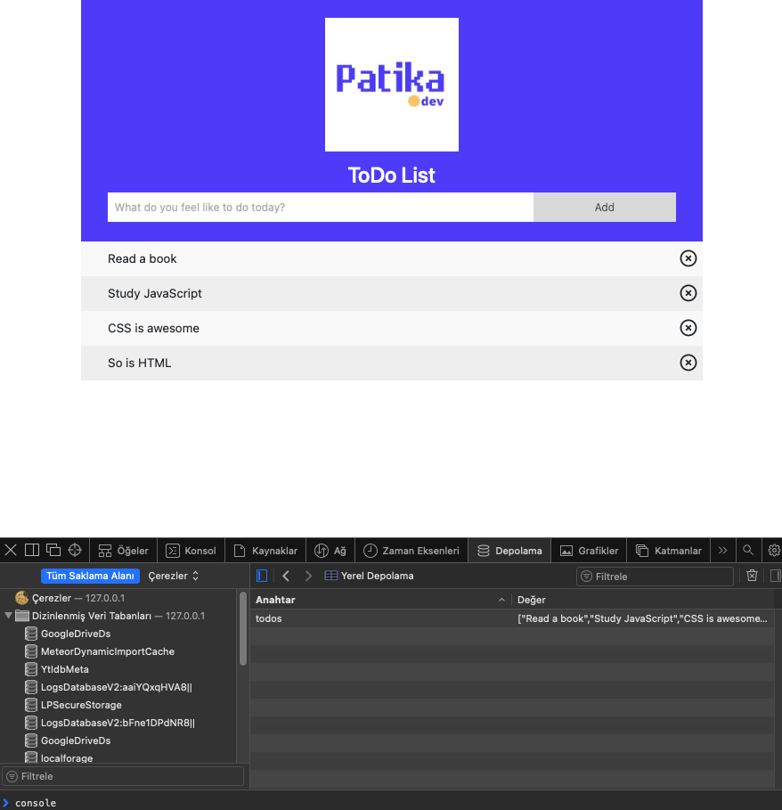

# ToDoV2

## This ToDo list created as a homework for [Patika.dev](https://patika.dev). Here are some features;

1. Can add ToDo items by clicking to the "Add" button.
2. Can mark ToDo items as completed by clicking on the list items.
3. Can delete list items by clicking on the "X" icon.
4. Won't accept null inputs. A toast will pop up on the top-right corner.
5. Your list items will also be saved in LocalStorage, when you load the page again, the list items you haven't removed will will still be there.

